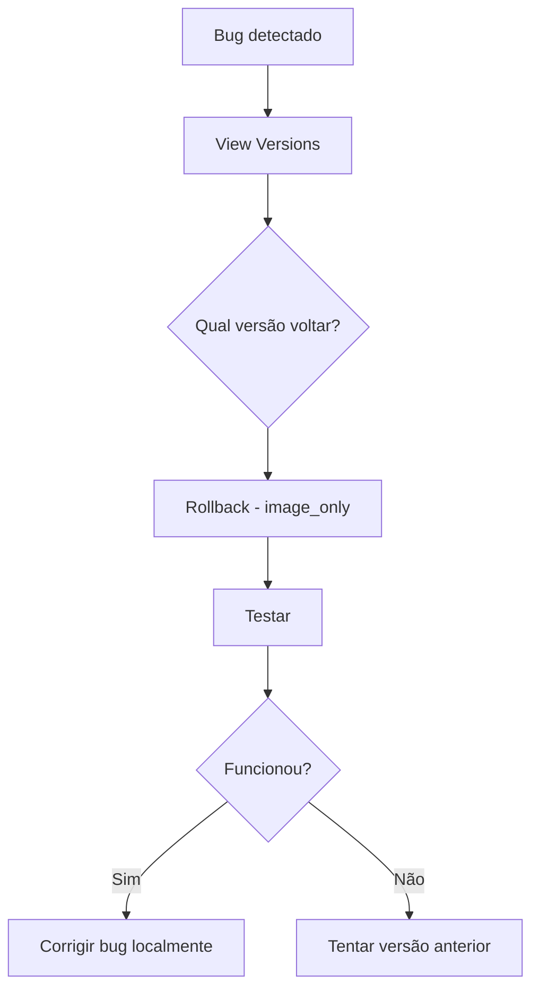
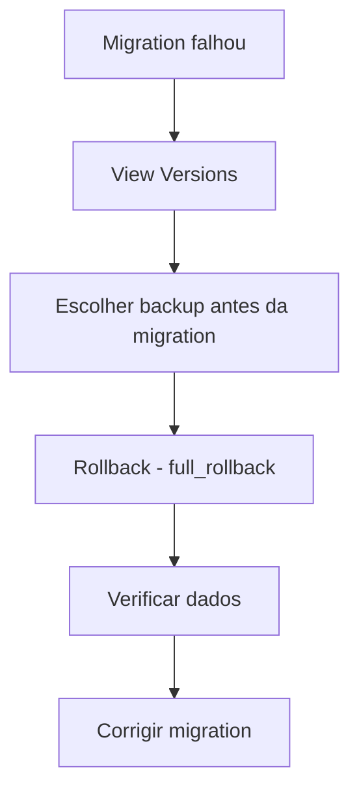
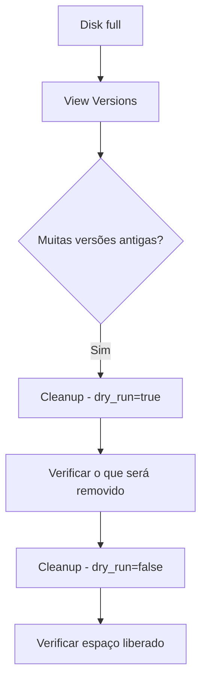

# 🚀 GitHub Actions Workflows - Gas e Água Backend

## Workflows Disponíveis

### 1. 🔄 Rollback (`rollback.yml`)

**Quando usar:** Reverter deploy com problemas

**Como executar:**
1. Ir para: `Actions` → `🔄 Rollback` → `Run workflow`
2. Preencher:
   - **Environment:** `dev` ou `prd`
   - **Rollback type:** 
     - `image_only` - Rápido, mantém banco (recomendado)
     - `database_only` - Só banco
     - `full_rollback` - Ambos (cuidado!)
   - **Version:** Tag da imagem (ex: `20251009-143022`) ou deixe vazio para `backup-latest`
   - **Backup file:** Nome do arquivo (ex: `backup-20251009-120000.sql`) - só para database/full
   - **Confirm:** Digite `CONFIRM`
3. Clicar em `Run workflow`

**Exemplos:**

#### Rollback rápido (apenas app):
```
Environment: prd
Rollback type: image_only
Version: (vazio para usar backup-latest)
Confirm: CONFIRM
```

#### Rollback de banco:
```
Environment: prd
Rollback type: database_only
Backup file: backup-20251009-120000.sql
Confirm: CONFIRM
```

#### Rollback completo:
```
Environment: prd
Rollback type: full_rollback
Version: 20251009-120000
Backup file: backup-20251009-120000.sql
Confirm: CONFIRM
```

---

### 2. 📜 View Versions (`view-versions.yml`)

**Quando usar:** Ver versões disponíveis antes de fazer rollback

**Como executar:**
1. Ir para: `Actions` → `📜 View Versions` → `Run workflow`
2. Escolher environment: `dev`, `prd` ou `both`
3. Ver no **Summary** da action:
   - Histórico de deploys
   - Imagens Docker disponíveis
   - Backups de banco disponíveis
   - Uso de storage

**Saída esperada:**
```
📜 Deploy History
Recent Deploys:
20251009-143022|abc1234|prd|gas-e-agua-app:20251009-143022
20251008-210015|def5678|dev|gas-e-agua-dev-app:20251008-210015

🐳 Docker Images - PRD
gas-e-agua-app    20251009-143022    2 hours ago    450MB
gas-e-agua-app    20251008-210015    1 day ago      448MB
gas-e-agua-app    backup-latest      2 hours ago    450MB

💾 Database Backups - PRD
backup-20251009-120000.sql    15M    Oct 9 12:00
backup-20251008-120000.sql    14M    Oct 8 12:00
```

---

### 3. 🧹 Cleanup Old Versions (`cleanup-versions.yml`)

**Quando usar:** Liberar espaço no servidor

**Como executar:**
1. Ir para: `Actions` → `🧹 Cleanup Old Versions` → `Run workflow`
2. Configurar:
   - **Dry run:** `true` (recomendado primeiro) - só mostra o que seria removido
   - **Keep images:** `5` (padrão) - quantas versões manter
   - **Keep backups days:** `7` (padrão) - dias de backups manter
3. Executar primeiro com dry_run=true
4. Verificar o que seria removido
5. Executar novamente com dry_run=false se OK

**Exemplo - Preview:**
```
Dry run: true
Keep images: 5
Keep backups days: 7
```

**Exemplo - Executar:**
```
Dry run: false
Keep images: 5
Keep backups days: 7
```

---

### 4. 🚀 Deploy DEV (`deploy-dev.yml`)

Deploy automático para ambiente de desenvolvimento

**Trigger:** Push ou PR para `develop`

---

### 5. 🚀 Deploy PRD (`deploy-prd.yml`)

Deploy para produção

**Trigger:** Push para `master`

---

### 6. 💾 Backup (`backup.yml`)

Backup manual do banco de dados

**Trigger:** Manual ou agendado

---

## Fluxo de Emergência

### Cenário 1: Bug crítico em produção



**Passos:**
1. **View Versions** (`prd`) - Ver versões disponíveis
2. **Rollback** (`prd`, `image_only`, `backup-latest`)
3. Testar aplicação
4. Corrigir bug e fazer novo deploy

**Tempo:** ~2-3 minutos

---

### Cenário 2: Migration quebrou o banco



**Passos:**
1. **View Versions** (`prd`) - Ver backups disponíveis
2. Identificar backup **antes** da migration ruim
3. **Rollback** (`prd`, `full_rollback`, especificar versão E backup)
4. Verificar se dados estão OK
5. Corrigir migration localmente
6. Testar em DEV
7. Deploy novamente

**Tempo:** ~5-10 minutos

---

### Cenário 3: Servidor sem espaço



**Passos:**
1. **View Versions** (`both`) - Ver uso de storage
2. **Cleanup** (dry_run=`true`) - Preview
3. **Cleanup** (dry_run=`false`) - Executar
4. **View Versions** novamente - Confirmar

---

## Secrets Necessários

Certifique-se de ter configurado no GitHub:

```
Settings → Secrets and variables → Actions
```

### Repository Secrets:
- `VPS_SSH_KEY` - Chave privada SSH
- `VPS_HOST` - IP ou hostname do servidor
- `VPS_USER` - Usuário SSH (geralmente `deploy`)

### Environment Secrets (dev e prd):
- Mesmos secrets acima podem ser reutilizados
- Ou específicos por ambiente se tiver VPS diferentes

---

## Segurança

### ✅ Proteções implementadas:

1. **Confirmação obrigatória** - Digite `CONFIRM` para rollback
2. **Dry run padrão** - Cleanup mostra preview antes de deletar
3. **Safety backups** - Criado antes de restaurar banco
4. **Health checks** - Verifica se app ficou saudável
5. **Logs detalhados** - Todos os passos registrados

### ⚠️ Cuidados:

1. **Full rollback** perde dados recentes do banco
2. **Database rollback** é irreversível (use safety backup se necessário)
3. **Verifique environment** - PRD vs DEV
4. **Confirme versão/backup** - Use View Versions primeiro

---

## Troubleshooting

### "SSH connection failed"

**Problema:** Secrets não configurados ou chave incorreta

**Solução:**
```bash
# Verificar se secrets existem
# Settings → Secrets → Actions

# Testar SSH manualmente
ssh -i ~/.ssh/id_rsa deploy@SEU_IP
```

### "Tag not found"

**Problema:** Versão especificada não existe

**Solução:**
1. Executar **View Versions** primeiro
2. Copiar tag exata da lista
3. Ou deixar vazio para usar `backup-latest`

### "Backup file not found"

**Problema:** Nome do arquivo incorreto

**Solução:**
1. Executar **View Versions**
2. Copiar nome exato do backup (ex: `backup-20251009-120000.sql`)
3. Incluir `.sql` no final

### "Container not healthy after rollback"

**Problema:** Mesmo versão antiga está com problemas

**Solução:**
1. Ver logs no Summary da action
2. Pode ser problema de configuração (.env)
3. SSH no servidor para investigar:
   ```bash
   docker compose logs app --tail 100
   ```

---

## Monitoramento

Após qualquer rollback:

1. ✅ Ver **Summary** da action
2. ✅ Testar health endpoint
3. ✅ Monitorar logs por 5-10min
4. ✅ Verificar Grafana (se disponível)
5. ✅ Documentar o incidente

---

## Boas Práticas

### Antes de fazer rollback:

- [ ] Ver versões disponíveis (**View Versions**)
- [ ] Identificar a última versão boa
- [ ] Decidir se precisa rollback de DB também
- [ ] Avisar equipe (se produção)

### Durante rollback:

- [ ] Escolher tipo correto (image/database/full)
- [ ] Confirmar environment (dev/prd)
- [ ] Monitorar logs da action
- [ ] Verificar health check

### Após rollback:

- [ ] Testar aplicação
- [ ] Monitorar por alguns minutos
- [ ] Documentar o problema
- [ ] Corrigir bug/migration
- [ ] Testar em DEV antes de novo deploy

---

## Exemplos Rápidos

### Ver o que está rodando agora:
```bash
# No GitHub Actions
View Versions → environment: prd

# Ou via SSH
ssh deploy@SEU_IP
docker compose ps
docker images | grep gas-e-agua-app | head -5
```

### Rollback de emergência (mais rápido):
```bash
# No GitHub Actions
Rollback → 
  environment: prd
  type: image_only
  version: (vazio)
  confirm: CONFIRM
```

### Limpar espaço:
```bash
# No GitHub Actions
Cleanup → 
  dry_run: true     # Ver primeiro
  keep_images: 3    # Manter menos se pouco espaço
  keep_backups: 5   # Manter menos dias
```

---

## Links Úteis

- [Deploy Guide](../../DEPLOY_MONITORING.md)
- [Rollback Guide](../../scripts/deploy/ROLLBACK_GUIDE.md)
- [Development Guide](../../DEVELOPMENT.md)

